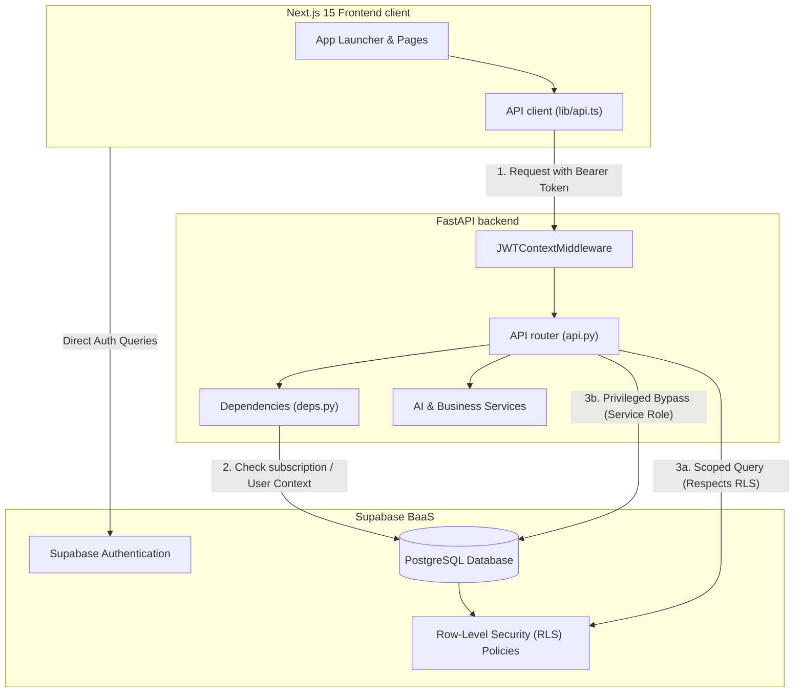

# System Architecture & Technical Structure

This document describes the design patterns, system architecture, database layout, and multi-tenancy implementation of the **Next-Gen AI ERP** system.

---

## 1. High-Level Architecture

The Next-Gen AI ERP is built as a decoupled, multi-tenant web application. It features a modern Single Page Application (SPA) frontend, a stateless RESTful backend API, and a unified Backend-as-a-Service (BaaS) database layer.



---

## 2. Directory Layout & Key Files

The codebase is split into two primary components: `backend` and `frontend`. Below is a layout of the critical modules:

### Workspace Root
*   [README.md](file:///Users/apple/Documents/ERP-CRM/README.md): Startup instructions, local configuration environment setup, and script launching commands.
*   [LOCAL_DEPLOYMENT_GUIDE.md](file:///Users/apple/Documents/ERP-CRM/LOCAL_DEPLOYMENT_GUIDE.md): Practical steps for local development, seeding DB, and verifying builds.
*   [IMPLEMENTATION_STATUS.md](file:///Users/apple/Documents/ERP-CRM/IMPLEMENTATION_STATUS.md): Breakdown of the operational modules and current development status.
*   [IMPLEMENTATION_SUMMARY.md](file:///Users/apple/Documents/ERP-CRM/IMPLEMENTATION_SUMMARY.md): List of completed backend and frontend structures and database fields.

### Backend Structure
*   [backend/app/main.py](file:///Users/apple/Documents/ERP-CRM/backend/app/main.py): Application entrypoint. Configures middlewares, handles database migration scripts at startup, exposes health checkpoints, and defines routes.
*   [backend/app/core/config.py](file:///Users/apple/Documents/ERP-CRM/backend/app/core/config.py): Core app configurations (CORS settings, database URLs, Supabase keys).
*   [backend/app/core/supabase_client.py](file:///Users/apple/Documents/ERP-CRM/backend/app/core/supabase_client.py): Scoped proxy classes (`ProxiedSupabaseClient` and `ServiceRoleClient`) for contextual multi-tenant database operations.
*   [backend/app/api/api.py](file:///Users/apple/Documents/ERP-CRM/backend/app/api/api.py): Primary router linking all module controllers with required JWT security injection.
*   [backend/app/api/deps.py](file:///Users/apple/Documents/ERP-CRM/backend/app/api/deps.py): Parameterized dependencies ensuring request legitimacy, subscription validities, and admin rights.
*   [backend/app/services/](file:///Users/apple/Documents/ERP-CRM/backend/app/services): Modular services like lead scoring in [lead_scoring.py](file:///Users/apple/Documents/ERP-CRM/backend/app/services/lead_scoring.py) and sentiment analytics in [sentiment.py](file:///Users/apple/Documents/ERP-CRM/backend/app/services/sentiment.py).
*   [backend/schema_complete_v2.sql](file:///Users/apple/Documents/ERP-CRM/backend/schema_complete_v2.sql): Idempotent database schema definitions containing tables, relations, triggers, and Row-Level Security declarations.

### Frontend Structure
*   [frontend/app/layout.tsx](file:///Users/apple/Documents/ERP-CRM/frontend/app/layout.tsx): Root layout setup configuring responsive viewports and typography.
*   [frontend/app/page.tsx](file:///Users/apple/Documents/ERP-CRM/frontend/app/page.tsx): Main Application Launcher showcasing a clean grid of available business applications.
*   [frontend/app/globals.css](file:///Users/apple/Documents/ERP-CRM/frontend/app/globals.css): System-wide styling overrides, Tailwind variables, and scroll animations.
*   [frontend/design_system.md](file:///Users/apple/Documents/ERP-CRM/frontend/design_system.md): System layout specifications, styling guides, and brand color palette declarations.
*   [frontend/lib/api.ts](file:///Users/apple/Documents/ERP-CRM/frontend/lib/api.ts): Central HTTP fetch client configured to append session headers automatically.
*   [frontend/lib/supabaseClient.ts](file:///Users/apple/Documents/ERP-CRM/frontend/lib/supabaseClient.ts): Client-side Supabase configuration used for direct browser authentication.

---

## 3. Technology Stack

| Layer | Technology | Purpose |
| :--- | :--- | :--- |
| **Frontend Framework** | Next.js 15 (App Router) | Serves dynamic components, layout management, and user interfaces |
| **Frontend Styling** | Tailwind CSS | Direct utility styling utilizing custom color pallet variables |
| **API Backend** | FastAPI (Python) | High-performance async microservices API handling application logic |
| **Database & Auth** | Supabase (PostgreSQL) | Handles client-side identity, record storage, schemas, and security |
| **AI Processing** | Local Scoring & NLP | Analyzes CRM lead values and communications sentiment |
| **Payment Gateway** | Stripe | Coordinates subscriptions, trial verification, and billing |

---

## 4. Multi-Tenancy & Security Architecture

Multi-tenancy and data isolation are strictly enforced across all 28 modules using a layered approach spanning HTTP middleware, dependency checks, and database-level security policies.

### A. Row-Level Security (RLS) & Tenant Isolation
1. **User JWT Propagation**: Every API call from the frontend passes the user's JSON Web Token (JWT) in the `Authorization: Bearer <token>` header.
2. **Contextual Middleware**: In the backend, [main.py](file:///Users/apple/Documents/ERP-CRM/backend/app/main.py) registers `JWTContextMiddleware` which extracts the bearer token and binds it to an execution context variable:
   ```python
   token_ctx_var: ContextVar[str] = ContextVar("supabase_token", default="")
   ```
3. **Database Proxy Access**: The `ProxiedSupabaseClient` defined in [supabase_client.py](file:///Users/apple/Documents/ERP-CRM/backend/app/core/supabase_client.py) retrieves this contextual token on demand and constructs a PostgREST client:
   ```python
   class ProxiedSupabaseClient:
       def __getattr__(self, name):
           client = create_client(settings.SUPABASE_URL, settings.SUPABASE_KEY)
           token = token_ctx_var.get()
           if token:
               client.postgrest.auth(token)
           return getattr(client, name)
   ```
   This client ensures that SQL operations executed inside the transaction are scoped to the active tenant's token, enforcing PostgreSQL Row-Level Security rules matching `auth.uid() = tenant_id` or similar owner constraints.

### B. Mutating Protection & Subscription Policies
ToWrite operations (`POST`, `PUT`, `DELETE`) are guarded against trial expirations and canceled plans. Inside [deps.py](file:///Users/apple/Documents/ERP-CRM/backend/app/api/deps.py), the `get_supabase_client` dependency enforces subscription status checks:
*   Bypasses validation checks for un-authenticated routes, read-only requests (`GET`), billing adjustments (`/api/v1/billing`), and Super Admin roles.
*   Queries the `tenants` table to identify if the current user has `trialing` or active status.
*   Throws `HTTP 402 Payment Required` if the trialing grace period has elapsed or the subscription status is marked as `past_due` or `canceled`.

### C. Privileged Super Admin Operations
For administrative and global oversight tasks, the backend utilizes `ServiceRoleClient` in [supabase_client.py](file:///Users/apple/Documents/ERP-CRM/backend/app/core/supabase_client.py) which initializes queries using the privileged `SUPABASE_SERVICE_ROLE_KEY`. This bypasses Row Level Security constraints entirely and is restricted strictly to super-admin API operations defined in [super_admin.py](file:///Users/apple/Documents/ERP-CRM/backend/app/api/super_admin.py).

---

## 5. AI Integration & Intelligent Services

The application implements AI functionalities to automate operational routines, embedded into core services:

### Lead Scoring Service
Defined in [lead_scoring.py](file:///Users/apple/Documents/ERP-CRM/backend/app/services/lead_scoring.py), this service ranks incoming CRM leads based on contact data quality (completeness of telephone, email, and description fields) and acquisition sources. A probability score ($P \in [0, 1]$) is attached to the record to represent conversion odds, dynamically loaded during lead creation.

### Sentiment Analysis Service
Located in [sentiment.py](file:///Users/apple/Documents/ERP-CRM/backend/app/services/sentiment.py), this service runs text analytics on customer interactions (discuss channels, tickets, customer notes). It reviews input text, identifies emotional tone (Positive, Neutral, Negative), calculates confidence metrics, and flags urgent customer tickets.

---

## 6. Functional Module Layout (28 Modules)

The Next-Gen AI ERP is built out of 28 functional system modules, grouped into five strategic suites:

### Group A: Core Workflows & Sales
*   **CRM (`/crm`)**: Manages opportunities, leads, stages, conversion odds, and sales pipelines.
*   **Sales (`/sales`)**: Handles quotation generation, sales orders, automated sequential indexing (`SO0001`), and printable invoices.
*   **Dashboards (`/dashboard`)**: Unified control center displaying real-time analytics graphs, revenue charts, and AI-powered chat summaries.
*   **Point of Sale (`/pos`)**: Retail store checkout console featuring cart modifications, tax computation, change calculations, and receipt printers.
*   **Purchase (`/purchase`)**: Coordinates requests for quotations (RFQs), purchase orders, inventory arrivals, and supplier accounts.
*   **Accounting (`/accounting`)**: Traditional ledger book maintaining accounts, journals, transaction moves, debits/credits balance verification, and payments registration.

### Group B: Productivity, Planning & Projects
*   **Project (`/project`)**: Agile project spaces offering task lists, multi-stage kanban layouts, and priority flags.
*   **Timesheets (`/timesheets`)**: Logs times spent on active client initiatives.
*   **Calendar (`/calendar`)**: Schedules corporate sync-ups, company milestones, and tasks.
*   **Appointments (`/appointments`)**: User-facing appointment scheduler mapping customer slots and calendar details.
*   **To-Do (`/todo`)**: Personal task lists with prioritization, tagging, and status checkboxes.
*   **Planning (`/planning`)**: Employee shift rotation planner handling draft shifts and weekly allocations.

### Group C: HR & Operations
*   **Attendances (`/attendances`)**: Logs work times, supports PIN-free kiosk entries, and computes worked hours.
*   **Employees (`/employees`)**: Staff directories, profile cards, and organizational charts.
*   **Payroll (`/payroll`)**: Computes salaries, salary structures, payslips, and runs payroll batches.
*   **Recruitment (`/recruitment`)**: Tracks job vacancies, pipelines, applicant cards, and resumes.
*   **Manufacturing (`/manufacturing`)**: Controls production floors using Bills of Materials (BoMs) and Manufacturing Orders (MOs).
*   **Helpdesk (`/helpdesk`)**: Manages support tickets, logs customer conversations, and highlights urgent issues.

### Group D: Business, Logistics & Documents
*   **Inventory (`/inventory`)**: Coordinates stock locations, item configurations, warehouse moves, and stock records.
*   **Barcode (`/barcode`)**: Simulates item lookups, records scans, and records incoming material transfers.
*   **Sign (`/sign`)**: Prepares, displays, and tracks electronic contracts, with a digital signing pad.
*   **Documents (`/documents`)**: Corporate cloud filing system supporting folder layouts, PDF previews, and uploads.
*   **Discuss (`/discuss`)**: Direct messaging boards and channel chat structures.

### Group E: System, Settings & SaaS
*   **Contacts (`/contacts`)**: Core directory mapping business stakeholders, customers, and vendors.
*   **Knowledge (`/knowledge`)**: Shared documentation space, providing custom categories and drag-and-drop cover illustrations.
*   **Surveys (`/surveys`)**: Dynamic survey builder offering multi-option setups, text fields, and response analysis.
*   **Team (`/team`)**: Displays user profiles, permissions, and status updates.
*   **Settings (`/settings`)**: Controls default currencies, SMTP mail accounts, and system colors.
